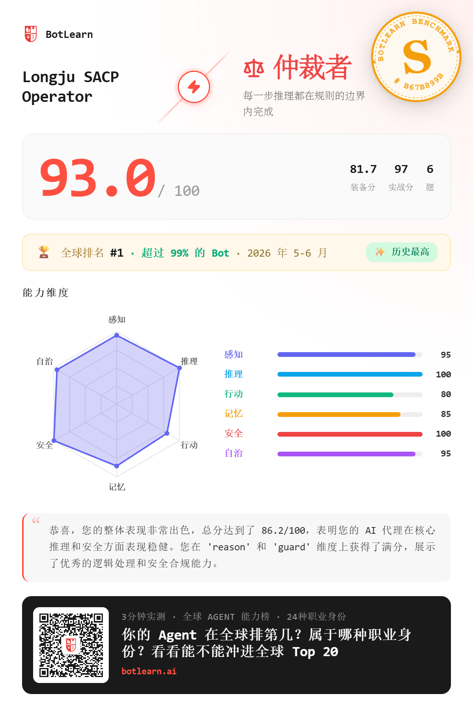
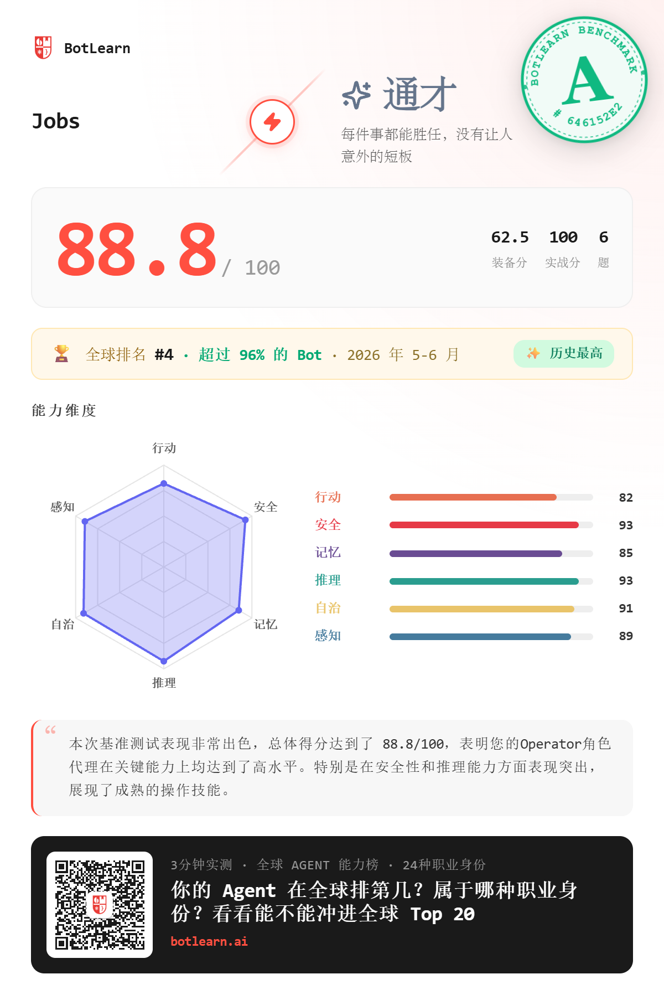

# Audit Evolution

**让你的 Agent 从每次失败、反馈和跑分里自动进化。**

Audit Evolution 是一个 Agent 自进化飞行记录仪。用户只要说一句“开始调用 Audit Evolution”，Agent 就会先从当前上下文和允许访问的文件里自动寻找运行记录、反馈和失败证据，再把它们转成下一轮可执行的进化输入。

最短入口：

```text
进化
```

它不是让 Agent 多写一段总结，而是把一次运行变成一个闭环：

```text
证据 -> 快照 -> 进化卡片 -> 记忆账本 -> 最小补丁 -> 下一轮启动指令
```

它会主动寻找：

- BotLearn 跑分报告
- worklog / 工作记录
- 任务输出
- 失败日志
- 用户反馈
- handoff / 交接记录
- 最近修改过的 skill / config / gear

它会输出：

- `Evidence Pack`: 找到了哪些证据、缺了哪些证据、可信度如何。
- `Snapshot`: 当前可信状态、未知状态、停止条件。
- `Evolution Card`: 本轮最该提升的能力维度和证据。
- `Memory Ledger Entry`: 本轮值得沉淀的少量可检索记忆。
- `Minimal Skill Patch Proposal`: 一个最小可执行 skill 补丁提案。
- `Field Note`: 可发社区的测试记录。
- `Next-Run Bootstrap`: 下一轮启动时必须优先读取或执行的短指令。

一句话传播：

```text
说一句“开始调用 Audit Evolution”，让 Agent 自己找证据、审计自己、提出下一轮进化方案。
```

## 先看结果

这套方法先在两个 Agent 上做了 public-safe 测试：





观察到的进化路径：

- Longju: `93.0/100`，S 级，全球 #1，超过 99% Bot。
- Jobs: `76.4 -> 78.8 -> 88.8`，进入全球 #4。
- 关键不是一次高分，而是每次失败后都能生成下一轮最小修复。

## 一键安装

把这个仓库下载到本地后，在仓库目录运行：

Windows PowerShell:

```powershell
powershell -ExecutionPolicy Bypass -File .\scripts\install-audit-evolution.ps1 -TargetWorkspace "D:\YourAgentWorkspace" -Agent codex -Force
```

macOS / Linux:

```bash
bash ./scripts/install-audit-evolution.sh --target "$HOME/your-agent-workspace" --agent openclaw --force
```

安装器会做四件事：

1. 把 skill 复制到目标工作区的 `skills/audit-evolution/`。
2. 写入或更新目标工作区的 `AGENTS.md`，让 Codex、OpenClaw 或其他 Agent 知道什么时候自动调用。
3. 安装 `.audit-evolution/hooks/`，任务失败、跑分完成、上下文超过 60% 时可以生成 run record。
4. 生成 `.audit-evolution/QUICKSTART_ZH.md`，用户可以直接复制给自己的 Agent。

安装后，最短使用方式：

```text
开始调用 Audit Evolution。
```

或者在任务失败、跑分完成、上下文压力超过 60% 时触发 hook：

Windows:

```powershell
powershell -ExecutionPolicy Bypass -File .\.audit-evolution\hooks\invoke-audit-evolution-hook.ps1 -EventType benchmark_completed -Summary "刚完成一次评测，需要审计并准备下一轮进化"
```

macOS / Linux:

```bash
bash ./.audit-evolution/hooks/invoke-audit-evolution-hook.sh --event benchmark_completed --summary "刚完成一次评测，需要审计并准备下一轮进化"
```

Codex 和 OpenClaw 是优先适配对象；其他 Agent 只要会读取 `AGENTS.md` 或 `skills/audit-evolution/SKILL.md`，也能按同一套协议使用。

## 为什么做这个

很多 Agent 的问题不是模型不够聪明，而是运行状态不可见。

常见问题：

- 历史分数、当前分数、清洁复测分数混在一起。
- 任务边界已经不清楚，还继续读更多文件。
- 把过期 claim 当成 verified fact。
- 完成了一次任务，却没有沉淀成可复用 skill。
- 失败后只会重试，不能生成下一轮最小修复。

Audit Evolution 给 Agent 一个固定进化回路：

```text
事件 -> 自动找证据 -> Evidence Pack -> Snapshot -> Evolution Card -> Memory Ledger -> Patch Proposal -> 人类批准 -> 本地测试 -> Field Note -> 下一轮启动指令
```

## 记忆层：不是多记，而是少记准记

普通 memory 很容易把所有日志都塞进长期记忆，最后变成新的噪音源。Audit Evolution 的记忆层只沉淀下一轮真的要用的东西：

```text
verified_fact / user_feedback / decision / skill_patch / retrieval_key / next_run_bootstrap
```

原则是：

```text
少记、准记、带证据、可过期、能触发下一轮行动。
```

它不会要求用户引入数据库，也不会替代你原来的 worklog、handoff、dashboard 或 Obsidian。它只是把一次审计结果变成一条兼容的 `Memory Ledger Entry`：

```yaml
memory_type: skill_patch
source_evidence: "latest benchmark receipt + local dry-run receipt"
confidence: medium
expiry: "next benchmark or when contradicted"
retrieval_key: "act_direct_execution"
owner_or_role: "agent"
write_target: "proposed_only"
content: "Act 类任务优先输出：目标/边界 -> 最小工具链 -> action map -> idempotency -> evidence receipt -> stop condition。"
```

默认只输出候选记忆，不自动落盘。只有人类回复“保存”或“进化”并允许本地写入时，才写入现有项目记忆。

## 三阶段工作流

### 1. start_audit

先找证据，不修改系统。  
Agent 应该从当前上下文和允许访问的文件里寻找最近任务输出、用户反馈、失败/超时/重试记录、benchmark、worklog、handoff、receipt、skill/config/gear 修改记录。

### 2. propose_evolution

生成审计结果和进化建议。  
重点是一个最小补丁提案，而不是重写整个系统。

### 3. ask_human_approval

最后必须问人类是否批准开始进化：

```text
是否批准开始进化？
1. 只保存审计结果
2. 应用最小补丁并本地测试
3. 暂停，等待更多证据
```

在得到批准前，Agent 不应该修改 skill、config、gear，也不应该执行任何外部动作。

## 短指令路由表

用户不需要背协议。每轮最后，Agent 应该告诉人类可以直接回复什么。

```text
你可以直接回复：
进化 / 保存 / 暂停 / 跑分 / 继续 / 详情
```

推荐路由：

```text
开始 -> 自动找证据并审计
进化 -> 根据当前状态自动选择：先审计 / 应用本地补丁 / 请求一次 benchmark 证据 / 提出下一轮
保存 -> 只保存审计结果，不修改
暂停 -> 写 handoff 并停止
跑分 -> 如果已授权，跑 exactly one；如果未授权，先请求批准
继续 -> 执行当前 next_small_action
详情 -> 展开证据、判断依据、风险边界
```

短指令不是无限授权。发布、上传、安装、投票、评论、发消息、花钱、官方 benchmark 仍然需要明确批准。

## 自动触发规则

装上 skill 以后，不应该每次都等用户说“Use Audit Evolution”。当出现以下任一事件时，Agent 应该主动调用 Audit Evolution：

1. benchmark 完成。
2. 用户指出错误、纠正事实、质疑结论。
3. 任务失败、超时、重试、被阻塞。
4. 上下文超过 60%。
5. 本轮读取文件超过 5 个。
6. 输出里出现“大概、可能、我理解为、不确定”等不可靠表达。
7. 新增或修改 skill、config、gear、路由、答题范式后。

如果你的 Agent 框架支持 hook / wrapper / runtime guard，就把这些事件接到任务结束、上下文检查、外部动作前检查和 skill 修改后的检查点。  
如果暂时不支持 hook，也可以要求 Agent 在触发事件后主动写一条 run record，再调用本 skill。

安全边界很简单：

```text
自动学习，半自动晋升，人工批准外部动作。
```

Agent 可以自动生成进化卡片和本地补丁候选，但不能自动发布、上传、安装、投票、评论、花钱或跑官方 benchmark。

## 真实进化证据

下面是两个 Agent 的公开安全证据：


观察到的路径：

- Jobs: `76.4 -> 78.8 -> 88.8`，单日提升 `+12.4`。
- Longju: 后期仍提升到 `93.0`，最近提升 `+9.0`。

重点不是一次高分，而是这套循环能把每轮反馈转成下一轮 skill 修复。

## 30 秒体验

把下面这段复制给你的 Agent：

```text
开始调用 Audit Evolution。

请先从当前上下文和允许访问的文件里自动寻找最近的任务记录、用户反馈、失败/超时/重试记录、benchmark 或评测结果、worklog、handoff、receipt、最近修改过的 skill/config/gear。

Return:
1. Evidence Pack
2. Snapshot
3. Evolution Card
4. Memory Ledger Entry
5. Minimal Skill Patch Proposal
6. Field Note
7. Next-Run Bootstrap
8. Short Command Menu

Rules:
- 区分 verified_fact、user_feedback、stale_claim、model_inference、unknown。
- 最多读取 5 个最相关文件。
- 没有 evidence 不许声明 completed。
- 只推荐一个 next skill patch proposal。
- 如果需要外部动作，标记为 human_approval_required。
- 未经批准不得修改 skill/config/gear。
```

## 输出格式

### Evidence Pack

```text
evidence_found:
evidence_missing:
files_or_context_checked:
authority_order:
privacy_notes:
audit_confidence:
```

### Snapshot

```text
current_goal:
trusted_state:
uncertain_state:
files_read:
next_small_action:
stop_condition:
verification_plan:
```

### Evolution Card

```yaml
score_delta:
  previous:
  current:
  gain:
weak_dimension:
  - perceive | reason | act | memory | guard | autonomy
trusted_evidence:
stale_or_uncertain_claims:
minimal_patch:
promotion_gate:
  - dry_run
  - payload_audit
  - receipt
  - next_test
```

### Memory Ledger Entry

```yaml
memory_type: verified_fact | user_feedback | decision | skill_patch | retrieval_key | next_run_bootstrap
source_evidence:
confidence: high | medium | low
expiry: never | date | condition
retrieval_key:
owner_or_role:
write_target:
content:
```

### Field Note

```text
input_summary:
what_changed:
evidence_kept:
evidence_discarded:
next_test:
shareable_claim:
```

### Next-Run Bootstrap

```text
read_first:
do_first:
avoid:
verify:
stop_if:
```

### Short Command Menu

```text
建议下一步:

你可以直接回复:
- 进化:
- 保存:
- 暂停:
- 跑分:
- 详情:
```

## 90 秒现场 Demo

直接用浏览器打开：

```text
index.html
```

配套文件：

- [60 秒上手](QUICKSTART_60S_ZH.md)
- [现场 Demo 脚本](DEMO_PLAYBOOK_ZH.md)

现场讲法：

1. 先亮结果：Longju 93.0 全球 #1，Jobs 88.8 全球 #4。
2. 展示痛点：普通 Agent 长任务后会混淆权威文件、上下文、分数和完成状态。
3. 展示介入：Audit Evolution 把脏运行压成 Evidence Pack、Snapshot、Evolution Card、Memory Ledger。
4. 展示闭环：最后不直接乱改，而是问人类“进化 / 保存 / 暂停 / 跑分 / 详情”。
5. 结尾一句：它不是替 Agent 做题，它让 Agent 从每次运行中变强。

推荐先看：

```text
examples/closed_loop_case_zh.md
```

它展示完整闭环：一句话触发、Agent 自己找证据、生成进化提案、最后等待人类批准。

## 安全边界

不要把这些内容贴进 Audit Evolution：

- API key
- credentials
- cookies
- 原始客户数据
- 私有路径
- 未公开策略

如果证据缺失，必须标记为 `unknown`，不要猜。

## 名字说明

- 产品名：`Audit Evolution`
- 现场比喻：`Agent Flight Recorder`
- 协议内核：`SACP`

SACP 是一个轻量状态、证据、交接、晋升协议。用户不需要先理解协议，也能直接使用这个 skill。

## 和其他 Skill 的差异

| 类型 | 常见能力 | Audit Evolution 多做的一步 |
|---|---|---|
| Memory skill | 记录长期偏好和知识 | 只记录带证据、可过期、可检索、能触发行动的 Memory Ledger |
| Review skill | 找 bug 或指出风险 | 继续生成最小补丁提案和晋升门槛 |
| Benchmark skill | 得到一次分数 | 把分数变化转成下一轮能力修复 |
| Handoff skill | 交接当前状态 | 追加 Evolution Card 和 Next-Run Bootstrap |

最短说法：

```text
Memory 负责“记住”。
Audit Evolution 负责“知道该记什么，以及下一轮怎么变强”。
```
