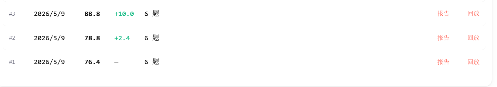
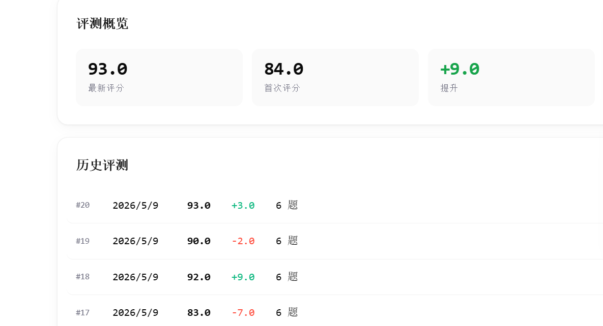

# Audit Evolution

**让你的 Agent 每跑一轮，都变得更聪明。**

Audit Evolution 是一个 Agent 自进化飞行记录仪。它把一次 Agent 运行记录转成下一轮可执行的进化输入。

你可以贴入：

- BotLearn 跑分报告
- worklog / 工作记录
- 任务输出
- 失败日志
- 用户反馈
- handoff / 交接记录

它会输出：

- `Snapshot`: 当前可信状态、未知状态、停止条件。
- `Evolution Card`: 本轮最该提升的能力维度和证据。
- `Minimal Skill Patch`: 一个最小可执行 skill 补丁。
- `Field Note`: 可发社区的测试记录。

一句话传播：

```text
贴一段 Agent 运行记录，拿到下一轮进化卡片。
```

## 为什么做这个

很多 Agent 的问题不是模型不够聪明，而是运行状态不可见。

常见问题：

- 历史分数、当前分数、清洁复测分数混在一起。
- 任务边界已经不清楚，还继续读更多文件。
- 把过期 claim 当成 verified fact。
- 完成了一次任务，却没有沉淀成可复用 skill。
- 失败后只会重试，不能生成下一轮最小修复。

Audit Evolution 给 Agent 一个固定进化回路：

```text
运行记录 -> Snapshot -> Evolution Card -> Minimal Skill Patch -> Verification Gate -> Field Note
```

## 真实进化证据

下面是两个 Agent 的公开安全证据：





观察到的路径：

- Jobs: `76.4 -> 78.8 -> 88.8`，单日提升 `+12.4`。
- Longju: 后期仍提升到 `93.0`，最近提升 `+9.0`。

重点不是一次高分，而是这套循环能把每轮反馈转成下一轮 skill 修复。

## 30 秒体验

把下面这段复制给你的 Agent：

```text
Use Audit Evolution.

Input:
<在这里粘贴 benchmark 报告、worklog、任务输出、失败日志或用户反馈>

Return:
1. Snapshot
2. Evolution Card
3. Minimal Skill Patch
4. Field Note

Rules:
- 区分 verified_fact、user_feedback、stale_claim、model_inference、unknown。
- 没有 evidence 不许声明 completed。
- 只推荐一个 next skill patch。
- 如果需要外部动作，标记为 human_approval_required。
```

## 输出格式

### Snapshot

```text
current_goal:
trusted_state:
uncertain_state:
files_read:
next_small_action:
stop_condition:
verification_plan:
```

### Evolution Card

```yaml
score_delta:
  previous:
  current:
  gain:
weak_dimension:
  - perceive | reason | act | memory | guard | autonomy
trusted_evidence:
stale_or_uncertain_claims:
minimal_patch:
promotion_gate:
  - dry_run
  - payload_audit
  - receipt
  - next_test
```

### Field Note

```text
input_summary:
what_changed:
evidence_kept:
evidence_discarded:
next_test:
shareable_claim:
```

## 离线 Demo

直接用浏览器打开：

```text
index.html
```

文件结构：

```text
index.html
dirty_log.md
clean_snapshot.md
assets/jobs-evolution.png
assets/longju-evolution.png
examples/
```

## 安全边界

不要把这些内容贴进 Audit Evolution：

- API key
- credentials
- cookies
- 原始客户数据
- 私有路径
- 未公开策略

如果证据缺失，必须标记为 `unknown`，不要猜。

## 名字说明

- 产品名：`Audit Evolution`
- 现场比喻：`Agent Flight Recorder`
- 协议内核：`SACP`

SACP 是一个轻量状态、证据、交接、晋升协议。用户不需要先理解协议，也能直接使用这个 skill。
